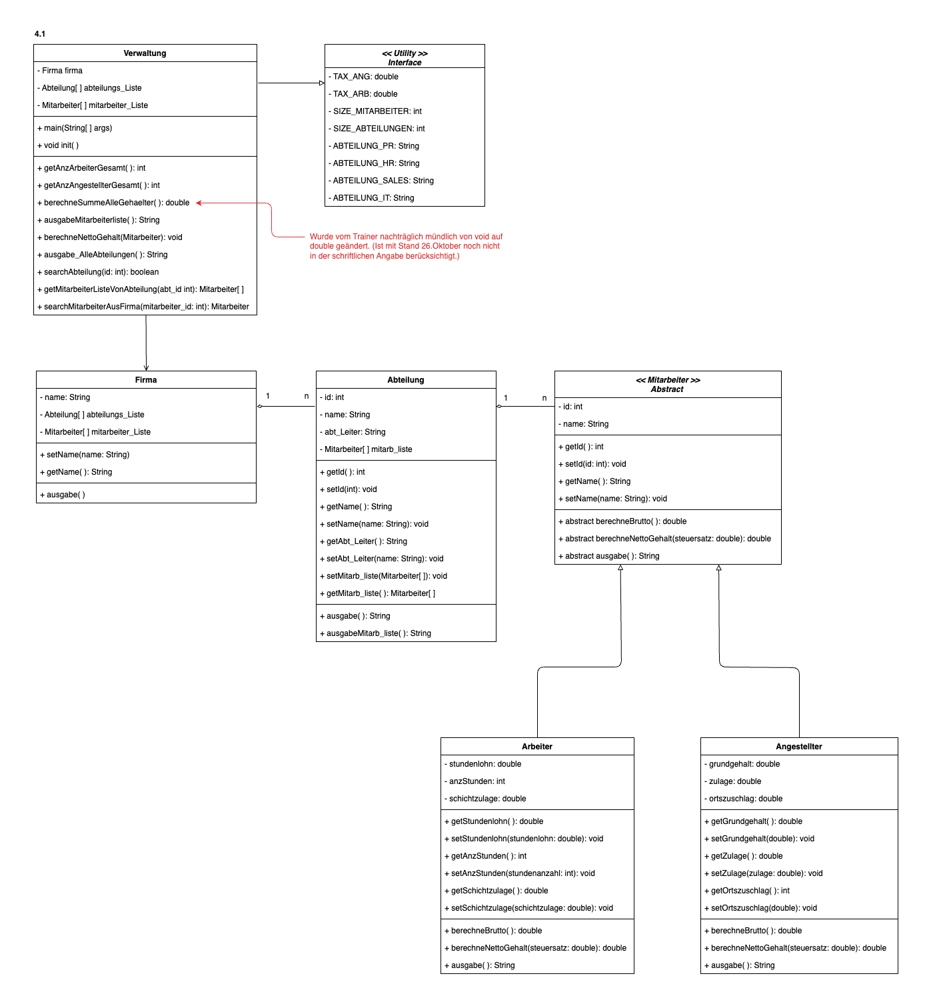

# Firma Version 4.1
Dieses Repo enthält die Java-Lösung zum ersten Teil von Version 4 des Projekts "Firma".

Zum Starten, bitte `Verwaltung.java` ausführen und auf die Console achten.

Die Datei `VerwaltungTest.java` enthält insgesamt elf JUnit-Tests.

## Klassendiagramm

Die Originaldateien des Klassendiagramms findet man hier: https://github.com/mbalabanov/ClassDiagramFirmaV4_1-4_4
